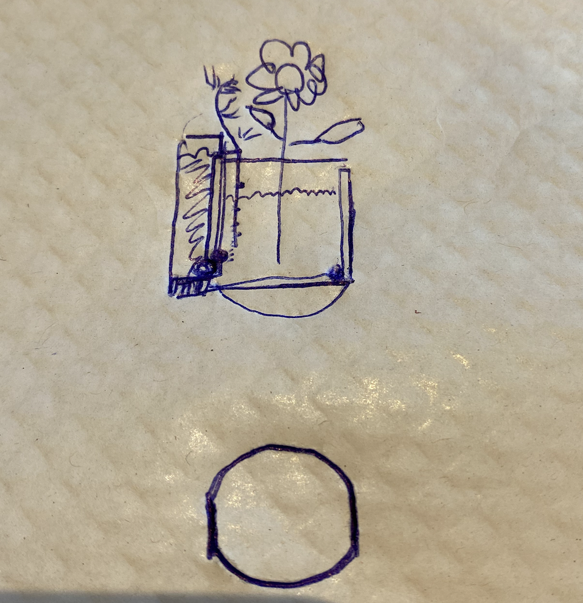
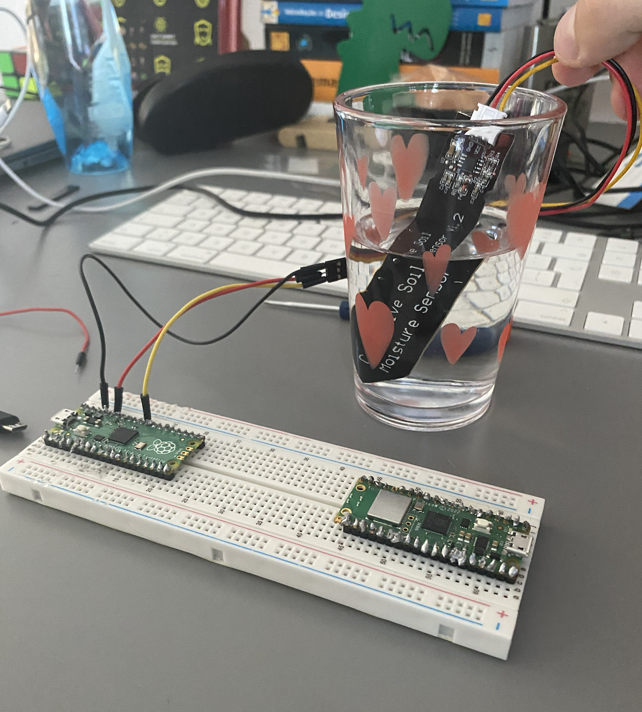
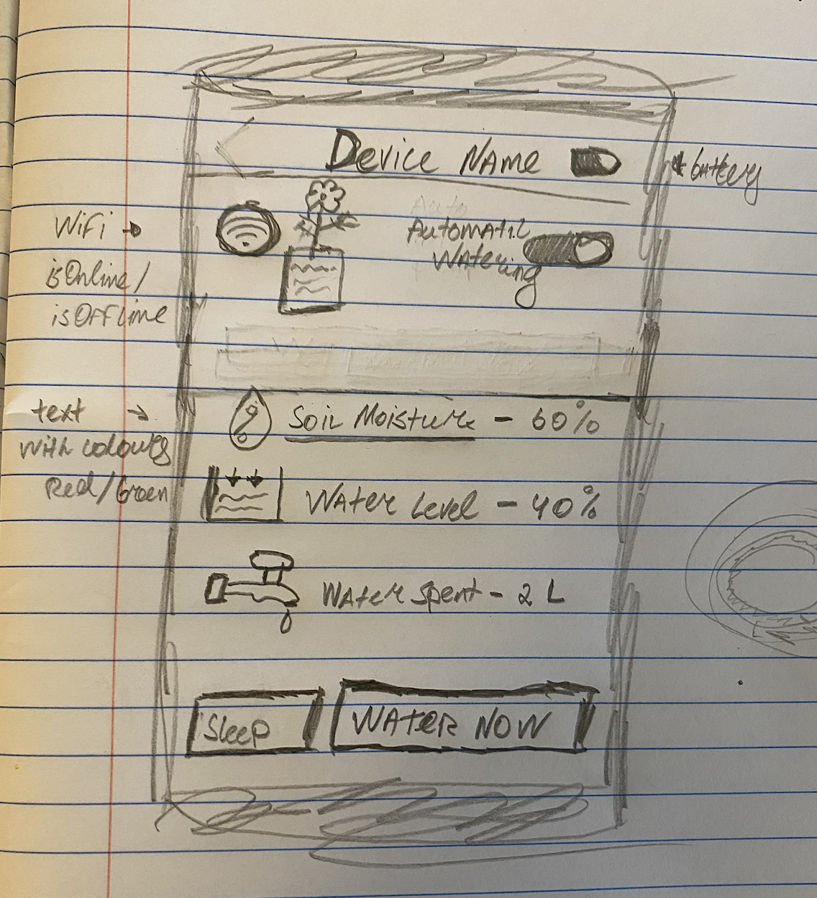

# IoT - Smart Watering

This project describes how to build an automated watering system which will water a plant in the vase. The technology uses the common IoT architecture consisting of sensor-controller-actuator. The sensor is a soil moisture sensor which measures when the plant in the soil needs to be watered. This values are then read by raspberry pi (RPI) pico microcontroller, which will decide when to enable the actuator - a water pump.

Furthermore, we are going to connect an RPI to our server, so that we can notify a user about moisture reading in real time.

## Blueprint

## Hardware requirements

## Software requirements

## Step 1 - Read Soil Moisture

## Step 2 - Build the Water Pump

Relay - https://arduinogetstarted.com/tutorials/arduino-relay
Water Pump - https://arduinogetstarted.com/tutorials/arduino-controls-pump

## Step 3 - Connect Sensor and Actuator - Water the plant when soil moisture is low

Start using a 12V adapter so that the pump works. Portability/energy should be handled in step 4.

### Requirements:

- Activate water pump when the soil moisture is low
- Disable water pump when the soil moisture is high
- Detect water level to know when there is no water to pump. In this scenario the pump should never activate even if the soil moisture is low.
- Send notification to the server when the water is over (may need water level detector) for a user to refill the water.
- **Nice to have** - As water pump activates, find a way to estimate how much water is spent

## Step 4 - Energy - make smart water system portable

### Requirements:

- Evaluate the energy consumption
- Figure a way to make the device portable (powered by battery).
- Find out how the battery can be recharged via plugging into Mains power.
- Send Energy Data to the server for user to be able to track battery consumption
- For outdoor usage. Study a possibility of charging device using green energy such as portable solar pannel.

### Solution

1 option is to use a battery of 12V. Are there any rechargeable?

Need to think of ways to recharge the battery/power it via solar panel etc.

## Step 5 - Waterproof raspberry pi, sensor and actuator

### Requirements

- Apply Conformal Coating to the electrical components to ensure that they will resist high levels of humidity

## Step 6 - Package - build 3D model of a plastic wrapping

## Step 7 - Build a Web Server

### Requirements

- Build a node.js https web server
- Web server should be able to handle the events of:
  - Soil-Moisture
  - Water-Level
  - Device battery Energy
  - Water spent watering the plants
  - isOnline/isOffline
- The server should be able to put a device to sleep/reboot/connected.
- The server should be able to activate water pump of a device
- The server should be able to disable water pump permanently until it is enabled
- The server should be able to put water pump in a enabled/default state
- The data should be persisted in database - e.g., _mongoose_
- The server should be publicly available on a known host

## Step 8 - Web Server on device

- The device should be able to connect to wifi configurable by user (persistent)
- The device should be able to receive commands such as sleep/reboot/connected, activate water pump manually, disable water pump permanently until it is enabled, and put water pump in a enabled/default state
- The device should notify a user when battery level is low
- The device should notify a user when the water level is low and turn off water pump permanently in that case

## Step 9 - Build a Web Site/Landing page

## Step 10 - Develop Mobile Apps IOS and Android

- For starter proof of concept, the mobile app can be a single page application (SPA).

### Requirements

- The user should be able to visualize one device information such as:
  - Wifi connection
  - battery level
  - soil moisture
  - water level
  - amount of water spent
- The user should be able to perform a set of actions such as:
  - activate water pump manually for watering
  - disable water pump permanently
  - put water pump into enabled/disabled state
  - reboot device
  - set device to sleep
- The user should be able to receive notifications from device such as:
  - water level is low
  - battery is low

### Initial Sketch

### Initial Figma Design

TODO

## Step 11 - Scale to multiple smart watering

- The Web server should be handle multiple users at the same time. Some authentication system should be set in place.
- The Web server should handle multiple user sessions at the same time where each user request should be identifiable in a secure way (no unauthorized access to other's data)
- A user may have several devices, therefore each device should be identifiable by a unique name/id with its respective data such as water-spent, battery energy, and soil moisture, etc.

## Step 12 (Optional) - Connect with AI

## Step 13 - Evaluate cost of production

## Step 14 - Go Live - Sale on Amazon
